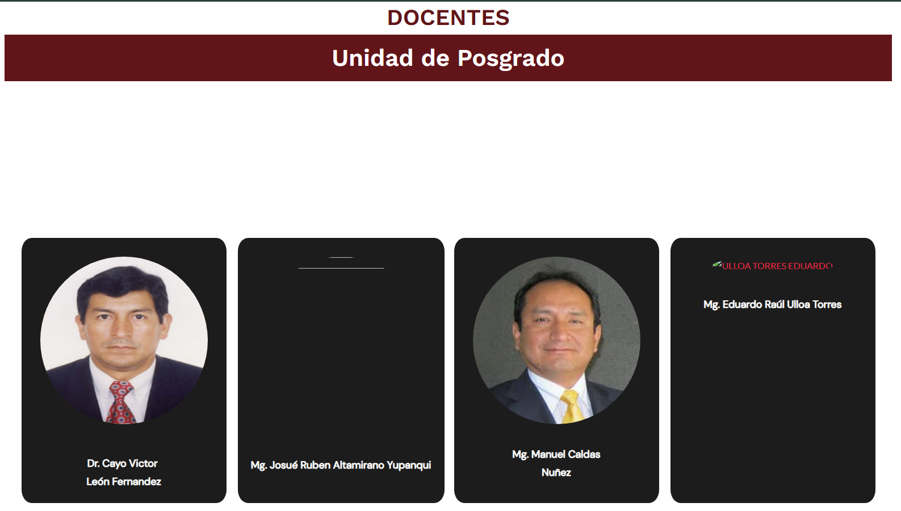
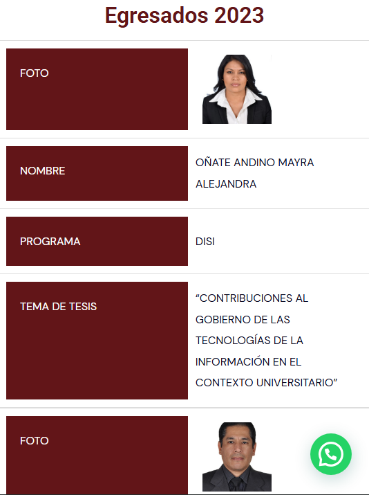
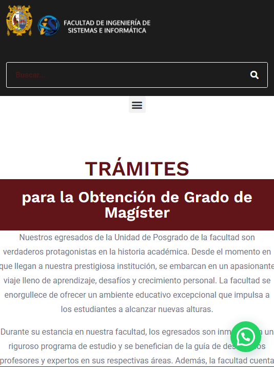

# Análisis de la página de Posgrado – FISI UNMSM

Link: [https://sistemas.unmsm.edu.pe/posgrado](https://sistemas.unmsm.edu.pe/posgrado)

---

## Rendimiento

Navegar entre las diferentes secciones de la página toma en promedio unos **5 segundos por cada cambio de página**, incluso tratándose de páginas estáticas. Este tiempo de carga es elevado para este tipo de contenido, donde lo habitual sería una carga casi instantánea.

Esto genera una experiencia de usuario lenta y poco fluida, afectando la percepción de calidad del sitio.

Como referencia, este es el rendimiento esperado en una web estática, donde el cambio entre páginas es inmediato:

[https://blog-demo-iota-dusky.vercel.app/](https://blog-demo-iota-dusky.vercel.app/)

---

## Seguridad

La página permite el acceso libre a la dirección
`https://sistemas.unmsm.edu.pe/posgrado/wp-json/`,
puerta de entrada a la API de WordPress.
Esto posibilita que cualquier persona consulte información sobre el sistema sin autenticación.

Por ejemplo, se puede acceder a la lista de usuarios registrados en:

```
https://sistemas.unmsm.edu.pe/posgrado/wp-json/wp/v2/users
```

Ejemplo de respuesta JSON:

```json
[
  {
    "id": 1,
    "name": "upg",
    "url": "https://sistemas.unmsm.edu.pe/posgrado",
    "description": "",
    "link": "https://sistemas.unmsm.edu.pe/posgrado/author/upg/",
    "slug": "upg",
    "avatar_urls": {
      "24": "https://secure.gravatar.com/avatar/f0ff54e6011f460333da378d1e8b7061ce35eb1ff4c98a1f98becbd13d4fe4ee?s=24&d=mm&r=g",
      "48": "https://secure.gravatar.com/avatar/f0ff54e6011f460333da378d1e8b7061ce35eb1ff4c98a1f98becbd13d4fe4ee?s=48&d=mm&r=g",
      "96": "https://secure.gravatar.com/avatar/f0ff54e6011f460333da378d1e8b7061ce35eb1ff4c98a1f98becbd13d4fe4ee?s=96&d=mm&r=g"
    },
    "meta": [],
    "is_super_admin": true
  }
]
```

Esto evidencia que la API expone información de los usuarios registrados y otros detalles internos del sistema y sus complementos, facilitando la obtención de datos privados o la exploración de la estructura del sitio por personas no autorizadas.

---

## Diseño

Más allá del rendimiento, la página transmite una sensación visual anticuada, con **múltiples inconsistencias** a nivel visual y de experiencia de usuario.

Se observan diferencias notorias en **espaciados, colores, tipografías y tamaños de texto** entre distintas secciones. Elementos como títulos, botones y bloques de contenido no siguen un criterio uniforme, generando una apariencia desordenada y poco profesional.

Ejemplos concretos:

---


*La barra de navegación presenta una falta de integración entre sus partes, espacios poco balanceados y estilos de íconos sociales distintos al resto de la web.*

---


*En la sección de perfiles, los espacios y tamaños no son proporcionales respecto al texto. Hay problemas de alineación y saltos de línea forzados.*

---



*En la sección de docentes, las imágenes y los bloques muestran aún más inconsistencias: algunas fotos cortadas, fondos y textos no uniformes, márgenes variables y recuadros vacíos o con errores de carga.*

---

Todo esto contribuye a una experiencia visual poco actual, improvisada y descuidada, lo que reduce la confianza y el interés de los usuarios.

---

## Responsividad

La página no ha sido diseñada considerando la experiencia de los usuarios móviles. Al acceder desde un celular, se observan varios problemas de visualización y navegación:

---



*En la sección de egresados, la disposición de imágenes y textos se vuelve confusa y no guarda proporción adecuada. El diseño tipo tabla no se adapta a pantallas pequeñas, dificultando la lectura y el reconocimiento visual.*

---



*En la sección de trámites, los textos son poco legibles por la falta de espacios adecuados y bloques extensos. Menú y buscador resultan poco accesibles.*

---

Estos problemas muestran que la página no está optimizada para móviles, lo que afecta la experiencia de quienes acceden desde teléfonos o tablets y puede llevar a un abandono prematuro del sitio.

---

## Accesibilidad

La página presenta **múltiples barreras de accesibilidad** que dificultan la experiencia de usuarios con discapacidad o necesidades especiales.
Principales problemas:

* **Contrastes insuficientes:** Textos y fondos con bajo contraste.
* **Textos pequeños y poco escalables:** Difíciles de leer, especialmente en móvil.
* **Imágenes sin etiquetas alternativas (“alt”):** Usuarios con lectores de pantalla no pueden acceder al contenido visual.
* **Jerarquía y navegación confusas:** Orden de los elementos no lógico; navegación solo con teclado o lectores de pantalla es difícil.
* **Tablas y diseños no adaptados:** La estructura tipo tabla no se reordena ni facilita la comprensión línea por línea o columna por columna en móvil.
* **Falta de roles y etiquetas ARIA:** No se emplean atributos que faciliten la navegación asistida.

Estos problemas limitan el alcance del sitio y pueden excluir a usuarios que dependen de tecnologías de asistencia o requieren mayor facilidad de lectura y navegación.
